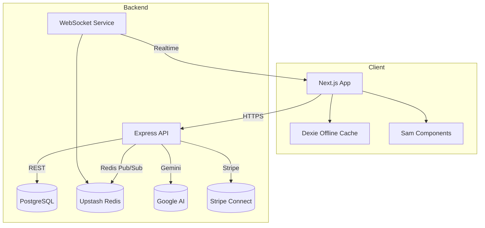

# HumanChat Architecture

## System Diagram

## Data Flow
1. **User actions** originate in the Next.js client. Mutations call REST endpoints (`/api/*`) while read-heavy resources synchronize through Dexie via background sync.
2. **Express API** validates auth, hits PostgreSQL for persistence, and emits domain events to Redis.
3. **WebSocket service** subscribes to Redis channels and distributes typing indicators, status updates, and session changes to connected clients.
4. **Sam concierge** requests are queued through `/api/sam`, routed to Gemini, validated, and persisted as Sam actions. Responses stream to clients via WebSocket and Dexie updates.
5. **Payments** flow through Stripe webhooks → API → Dexie to keep UI state consistent.

## Component Hierarchy (Web)
- `app/layout.tsx`
  - `ConversationSidebar`
    - `ConversationListItem`
  - `ConversationView`
    - `ChatArea`
      - `MessageBubble`
      - `ActionRenderer`
    - `VideoCallPanel`
  - `DiscoverPanel`
  - `MobileBottomNav`
  - `SamChatView`

Each component is documented in `COMPONENTS.md` with props and usage.

## State Management
- **Dexie** stores conversations, messages, sessions, managed requests, and settings.
- **Zustand**: lightweight store for UI flags (active conversation, modals, booking state).
- **React Query** handles server mutations + cache invalidation for admin dashboards.
- **WebSockets** push updates into Dexie to keep UI real-time.

## Database Schema
Key tables (see `src/lib/db.ts` & migrations):
- `conversations(conversationId, type, participants, lastActivity, unreadCount, linkedSessionId)`
- `messages(id, conversationId, senderId, content, timestamp, type, actions)`
- `sessions(sessionId, conversationId, hostUserId, guestUserId, status, startTime, durationMinutes, agreedPrice, paymentMode)`
- `settings(key, value)`
- `requests(requestId, requesterId, targetUserId, managerId, representativeName, status, createdAt)`
- Server-side Postgres mirrors these plus user/auth tables, payments, metrics logs (defined in `src/server/db/migrations`).

## API Structure
- `GET/POST /api/auth/*` – login, logout, token refresh
- `GET /api/conversations` – list with pagination
- `POST /api/conversations/:id/messages` – send message
- `POST /api/sessions` – create session / booking
- `PATCH /api/sessions/:id` – update status
- `POST /api/payments/*` – Stripe intents, donations, webhooks
- `POST /api/sam` – Sam concierge requests
- `GET /api/admin/*` – metrics, users, requests, announcements (RBAC)
- `GET /ws` – WebSocket upgrade for status + notifications

Full contract lives in `openapi.yaml` and summarized in `API_DOCS.md`.

## Operational Concerns
- Deployments: Vercel (frontend) + Railway (API/WS). Terraform modules under `infra/`.
- Observability: Sentry, Better Uptime, PostHog.
- Scaling: Cloud Run autoscaling, Cloud SQL high-availability, Upstash multi-region.
- Security: JWT auth, Redis-backed rate limiting, CSP + Helmet middleware.
